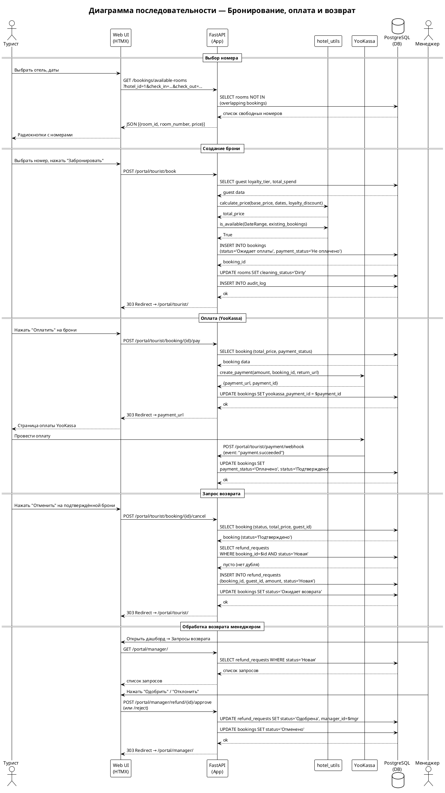

# Отчёт по проекту: Система управления бронированием отеля

> **Проект:** Hotel Booking Management System  
> **СУБД:** PostgreSQL 16  
> **Стек:** FastAPI · asyncpg · Jinja2 · Docker  
> **Дата составления отчёта:** 2026-05-27

---

## 1. Описание целевой аудитории и типовые задачи

### 1.1 Целевая аудитория

Система ориентирована на **три группы пользователей** гостиничного бизнеса:

| Группа | Кто это | Примеры |
|--------|---------|---------|
| **Туристы (гости)** | Физические лица, бронирующие номера | Командировочные, туристы, семьи |
| **Персонал отеля** | Сотрудники разных уровней | Менеджеры, горничные, техники, администраторы |
| **Управляющие** | Руководство и топ-менеджмент | Директора отделений, главные менеджеры |

**Масштаб**: сеть отелей (несколько отделений в разных городах), 10–500 номеров на отель, десятки сотрудников.

### 1.2 Типовые задачи по группам

#### Туристы
- Проверить доступность номеров на конкретные даты
- Забронировать номер (с учётом категории и цены)
- Оплатить бронирование онлайн (через YooKassa)
- Запросить возврат средств при отмене
- Заказать дополнительные услуги (завтрак, SPA, трансфер)
- Оставить отзыв после завершения пребывания

#### Персонал (горничные, техники)
- Просмотреть список номеров, требующих уборки
- Изменить статус уборки номера (Dirty → Cleaning → Clean)
- Подать заявку на пополнение расходных материалов
- Посмотреть своё расписание смен

#### Менеджеры
- Управлять бронированиями (подтвердить, отменить, завершить)
- Обрабатывать запросы на возврат (одобрить / отклонить)
- Составлять расписание смен для персонала
- Отслеживать заявки на расходные материалы
- Мониторить состояние номерного фонда

#### Администраторы
- Управлять учётными записями персонала и гостей
- Создавать сервисные заявки и назначать их менеджерам
- Просматривать лог аудита всех изменений
- Управлять справочниками (категории номеров, услуги)

### 1.3 Бизнес-ценность БД

| Задача | Какие таблицы задействованы |
|--------|----------------------------|
| Проверка доступности номеров | `bookings`, `rooms`, `room_categories` |
| Программа лояльности (скидки) | `guests` (loyalty_tier, total_spend) |
| Онлайн-оплата | `bookings` (payment_status, yookassa_payment_id) |
| Управление возвратами | `refund_requests`, `bookings` |
| Расписание уборки | `rooms` (cleaning_status), `staff_schedules` |
| Аудит всех изменений | `audit_log` |
| Сезонное ценообразование | Логика в `hotel_utils` (multiplier 0.85–1.30) |

---

## 2. Существующие аналоги на рынке ПО

### 2.1 Обзор основных систем

| Система | СУБД | Архитектура | Ключевые возможности |
|---------|------|-------------|---------------------|
| **Opera PMS** (Oracle Hospitality) | Oracle DB | Монолит / клиент-сервер | Полный цикл PMS, интеграция с GDS, CRS, POS |
| **Amadeus Property Management** | Oracle / MS SQL | SOA / микросервисы | Централизованное управление сетью отелей |
| **Bitrix24 (Hotel)** | MySQL / PostgreSQL | SaaS / монолит | CRM + бронирование, воронка продаж |
| **Bnovo** | PostgreSQL | SaaS / REST API | Российский PMS, channel manager, онлайн-касса |
| **Hotelero** | MySQL | SaaS | Малый и средний бизнес РФ, простой интерфейс |
| **1С: Отель** | MS SQL / PostgreSQL | Клиент-сервер | Интеграция с 1С:Бухгалтерия, фискальный учёт |

### 2.2 Сравнение по СУБД

| Характеристика | Данный проект | Opera PMS | Bnovo |
|----------------|---------------|-----------|-------|
| **СУБД** | PostgreSQL 16 | Oracle DB | PostgreSQL |
| **Доступ к БД** | asyncpg (async) | JDBC | ORM |
| **Лицензия** | Open Source | Коммерческая | SaaS |
| **Развёртывание** | Docker / self-hosted | On-premise / Cloud | Cloud-only |
| **Языковая локализация** | RU | EN/мультиязычный | RU |

### 2.3 Функциональное сравнение

| Функция | Данный проект | Opera PMS | Bnovo |
|---------|:---:|:---:|:---:|
| Бронирование номеров | ✅ | ✅ | ✅ |
| Онлайн-оплата | ✅ YooKassa | ✅ Stripe/PayPal | ✅ ЮKassa/Сбер |
| Программа лояльности | ✅ (3 уровня) | ✅ | ❌ базовая |
| Управление уборкой | ✅ | ✅ | ❌ |
| Аудит изменений | ✅ | ✅ | ❌ |
| Channel Manager | ❌ | ✅ | ✅ |
| Фискальный учёт (ОФД) | ❌ | ✅ | ✅ |
| Открытый исходный код | ✅ | ❌ | ❌ |

### 2.4 Архитектурные отличия данного проекта

Проект использует **современный асинхронный стек** вместо классического синхронного ORM:

- **FastAPI** вместо Django/Flask — выше производительность, встроенная OpenAPI-документация
- **asyncpg** вместо SQLAlchemy ORM — прямые SQL-запросы, полный контроль над планами выполнения
- **HTMX** вместо SPA (React/Vue) — серверный рендеринг без тяжёлого JS-фреймворка
- **Миграции вручную (SQL)** вместо Alembic — прозрачность и контроль над DDL

---

## 3. Описание реализуемого процесса в нотациях

### 3.1 Диаграмма последовательности — Бронирование, оплата и возврат



_(Файл диаграммы: `diagrams/sequence.puml`)_

### 3.2 Жизненный цикл бронирования (диаграмма состояний)

```
                 ┌─────────────────────────────────────────────────────┐
                 │                  СТАТУСЫ БРОНИРОВАНИЯ                │
                 └─────────────────────────────────────────────────────┘

  [Создание брони]
       │
       ▼
┌─────────────────┐    Оплата прошла    ┌───────────────┐    Дата выезда    ┌─────────────┐
│  Ожидает оплаты │ ──────────────────► │  Подтверждено │ ────────────────► │  Завершено  │
└─────────────────┘                     └───────────────┘                   └─────────────┘
       │                                       │
       │ Не оплачено                           │ Гость запросил отмену
       ▼                                       ▼
┌─────────────────┐              ┌──────────────────────┐
│    Отменено     │ ◄───────────│   Ожидает возврата   │
└─────────────────┘  Менеджер   └──────────────────────┘
                    отклонил
```

### 3.3 Контекстная диаграмма системы

```
                    ┌──────────────────────────────────┐
     Турист ──────►│                                  │◄────── YooKassa
                    │   Hotel Booking Management       │
     Менеджер ────►│          System                  │◄────── OpenStreetMap
                    │        (FastAPI + PostgreSQL)    │
     Горничная ───►│                                  │◄────── TestPyPI
                    │                                  │       (hotel_utils)
     Администратор►│                                  │
                    └──────────────────────────────────┘
```

---

## 4. Схема данных

### 4.1 ER-диаграмма

_(Файл: `diagrams/erd.puml` — открыть в PlantUML или на сайте plantuml.com)_

```
hotels ──────────────── rooms ─────────── bookings ─────────────── refund_requests
  │                       │   \               │   \                       │
  │                  room_categories      guests    service_orders        │
  │                                         │           │                 │
  └──── staff ──────────────────────────────┘       services             │
           │                                                              │
           ├──── staff_schedules                                          │
           ├──── service_requests                                         │
           ├──── replenishment_requests                                   │
           └──── audit_log                                                │
                                                                          │
guests ─── guest_pref_link ─── guest_preferences                         │
  │                                                                       │
  └──── users                                                             │
  │                                                                       │
  └──── reviews ─── bookings                                             │
  │                                                                       │
  └─────────────────────────────────────────────────────────────────────┘
```

### 4.2 Описание таблиц

#### Таблица `hotels` — Отели (отделения)

| Столбец | Тип | Описание |
|---------|-----|----------|
| `id` | SERIAL PK | Идентификатор |
| `name` | VARCHAR(200) | Название отеля |
| `address` | TEXT | Адрес |
| `director_name` | VARCHAR(200) | ФИО директора |
| `overbooking_limit` | INT | Лимит овербукинга |
| `latitude` | DECIMAL | Широта (геолокация) |
| `longitude` | DECIMAL | Долгота (геолокация) |

#### Таблица `room_categories` — Категории номеров

| Столбец | Тип | Описание |
|---------|-----|----------|
| `id` | SERIAL PK | Идентификатор |
| `name` | VARCHAR(100) | Название (Standard, Lux, President, Economy) |
| `base_price` | NUMERIC(10,2) | Базовая цена за ночь, руб. |
| `capacity` | INT | Вместимость (человек) |

#### Таблица `rooms` — Номера

| Столбец | Тип | Описание |
|---------|-----|----------|
| `id` | SERIAL PK | Идентификатор |
| `hotel_id` | INT FK → hotels | Отель |
| `category_id` | INT FK → room_categories | Категория |
| `room_number` | INT | Номер комнаты |
| `cleaning_status` | VARCHAR(20) | Clean / Dirty / Cleaning |
| `room_condition` | VARCHAR(20) | Исправно / Ремонт |

#### Таблица `guests` — Гости

| Столбец | Тип | Описание |
|---------|-----|----------|
| `id` | SERIAL PK | Идентификатор |
| `full_name` | VARCHAR(300) | ФИО |
| `passport` | VARCHAR(100) UNIQUE | Паспортные данные |
| `phone` | VARCHAR(30) | Телефон |
| `email` | VARCHAR(200) | E-mail |
| `loyalty_tier` | VARCHAR(20) | Silver / Gold / Platinum |
| `total_spend` | NUMERIC(12,2) | Суммарные расходы (для уровня) |

#### Таблица `bookings` — Бронирования

| Столбец | Тип | Описание |
|---------|-----|----------|
| `id` | SERIAL PK | Идентификатор |
| `guest_id` | INT FK → guests | Гость |
| `room_id` | INT FK → rooms | Номер |
| `staff_id` | INT FK → staff | Сотрудник, оформивший |
| `check_in` | DATE | Дата заезда |
| `check_out` | DATE | Дата выезда |
| `total_price` | NUMERIC(12,2) | Итоговая цена |
| `status` | VARCHAR(20) | Ожидает оплаты / Подтверждено / Ожидает возврата / Отменено / Завершено |
| `payment_status` | VARCHAR(20) | Не оплачено / Оплачено / Возврат |
| `yookassa_payment_id` | VARCHAR(50) | ID платежа в YooKassa |

#### Таблица `services` — Услуги

| Столбец | Тип | Описание |
|---------|-----|----------|
| `id` | SERIAL PK | Идентификатор |
| `name` | VARCHAR(200) | Название (Завтрак, SPA, Пакет Романтик…) |
| `price` | NUMERIC(10,2) | Цена |
| `is_package` | BOOLEAN | Признак пакета |

#### Таблица `service_orders` — Заказы услуг

| Столбец | Тип | Описание |
|---------|-----|----------|
| `id` | SERIAL PK | Идентификатор |
| `booking_id` | INT FK → bookings | Бронирование |
| `service_id` | INT FK → services | Услуга |
| `quantity` | INT | Количество |
| `ordered_at` | TIMESTAMP | Время заказа |

#### Таблица `staff` — Персонал

| Столбец | Тип | Описание |
|---------|-----|----------|
| `id` | SERIAL PK | Идентификатор |
| `hotel_id` | INT FK → hotels | Отель |
| `full_name` | VARCHAR(300) | ФИО |
| `role` | VARCHAR(50) | Администратор / Менеджер / Горничная / Уборщик / Сантехник / Бармен / Техник |
| `login` | VARCHAR(100) UNIQUE | Логин |
| `password_hash` | VARCHAR(200) | Хеш пароля (bcrypt) |
| `manager_id` | INT FK → staff | Руководитель (иерархия) |

#### Таблица `refund_requests` — Запросы на возврат

| Столбец | Тип | Описание |
|---------|-----|----------|
| `id` | SERIAL PK | Идентификатор |
| `booking_id` | INT FK → bookings | Бронирование |
| `guest_id` | INT FK → guests | Гость |
| `amount` | NUMERIC(10,2) | Сумма возврата |
| `status` | VARCHAR(20) | Новая / Одобрена / Отклонена |
| `created_at` | TIMESTAMP | Дата создания |
| `resolved_at` | TIMESTAMP | Дата решения |
| `manager_id` | INT FK → staff | Менеджер, обработавший |

#### Таблица `audit_log` — Лог аудита

| Столбец | Тип | Описание |
|---------|-----|----------|
| `id` | SERIAL PK | Идентификатор |
| `staff_id` | INT FK → staff | Сотрудник |
| `table_name` | VARCHAR(100) | Таблица |
| `old_value` | TEXT | Старое значение (JSON) |
| `new_value` | TEXT | Новое значение (JSON) |
| `changed_at` | TIMESTAMP | Время изменения |

#### Таблица `reviews` — Отзывы

| Столбец | Тип | Описание |
|---------|-----|----------|
| `id` | SERIAL PK | Идентификатор |
| `booking_id` | INT FK → bookings UNIQUE | Бронирование (1 отзыв на 1 бронь) |
| `guest_id` | INT FK → guests | Гость |
| `hotel_id` | INT FK → hotels | Отель |
| `rating` | INT CHECK(1–5) | Оценка |
| `comment` | TEXT | Комментарий |
| `created_at` | TIMESTAMP | Дата |

#### Таблица `staff_schedules` — Расписание смен

| Столбец | Тип | Описание |
|---------|-----|----------|
| `id` | SERIAL PK | Идентификатор |
| `staff_id` | INT FK → staff | Сотрудник |
| `work_date` | DATE | Дата смены |
| `shift` | VARCHAR(20) | Утро / День / Вечер / Ночь |
| `note` | TEXT | Примечание |

#### Таблицы `service_requests` и `replenishment_requests` — Заявки

| Таблица | Назначение |
|---------|-----------|
| `service_requests` | Сервисные заявки Администратор → Менеджер |
| `replenishment_requests` | Заявки на расходные материалы Персонал → Менеджер |

#### Таблицы `users`, `guest_preferences`, `guest_pref_link`

| Таблица | Назначение |
|---------|-----------|
| `users` | Учётные записи туристов (привязка к guests) |
| `guest_preferences` | Справочник предпочтений (Без ковролина, Вид на море…) |
| `guest_pref_link` | Связь M:N между guests и guest_preferences |

### 4.3 Индексы

```sql
-- Быстрый поиск номеров по отелю и категории
CREATE INDEX idx_rooms_hotel    ON rooms(hotel_id);
CREATE INDEX idx_rooms_category ON rooms(category_id);

-- Поиск бронирований
CREATE INDEX idx_bookings_guest ON bookings(guest_id);
CREATE INDEX idx_bookings_room  ON bookings(room_id);
CREATE INDEX idx_bookings_dates ON bookings(check_in, check_out);  -- проверка доступности

-- Аудит
CREATE INDEX idx_audit_staff  ON audit_log(staff_id);
CREATE INDEX idx_audit_table  ON audit_log(table_name);

-- Операционные таблицы
CREATE INDEX idx_service_req_hotel  ON service_requests(hotel_id);
CREATE INDEX idx_replenish_staff    ON replenishment_requests(staff_id);
CREATE INDEX idx_schedules_staff    ON staff_schedules(staff_id, work_date);
CREATE INDEX idx_reviews_hotel      ON reviews(hotel_id);
```

### 4.4 Ключевые ограничения целостности

- `rooms`: UNIQUE(hotel_id, room_number) — не допускает дублей номеров в одном отеле
- `guests`: UNIQUE(passport) — один гость = один паспорт
- `staff`: UNIQUE(login) — уникальный логин для каждого сотрудника
- `bookings`: CHECK(check_out > check_in) — корректность дат
- `reviews`: UNIQUE(booking_id) — один отзыв на одно бронирование
- `staff_schedules`: UNIQUE(staff_id, work_date) — одна смена в день

---

## 5. Файл БД в выбранной СУБД

**СУБД:** PostgreSQL 16

Файлы базы данных расположены в корне проекта:

| Файл | Тип | Описание |
|------|-----|----------|
| `hotel_db.sql` | SQL-дамп (текст) | Структура + данные в формате `pg_dump --inserts` |
| `hotel_db.dump` | Бинарный дамп | Формат `pg_dump -Fc` для быстрого восстановления |

### Восстановление из дампа

```bash
# Из SQL-файла (читаемый формат)
psql -U postgres -d hotel_db < hotel_db.sql

# Из бинарного дампа (быстрее для больших БД)
pg_restore -U postgres -d hotel_db hotel_db.dump
```

### Структура миграций

```
migrations/
├── 001_init.sql           # Базовая схема (11 таблиц, индексы)
├── 002_seed.sql           # Тестовые данные (3 отеля, 10 гостей, 12 броней)
├── 003_roles_auth.sql     # RBAC: users, reviews, service_requests, staff_schedules
├── 004_coordinates.sql    # Геолокация отелей (latitude, longitude)
├── 005_payment_status.sql # Статус оплаты в bookings
├── 006_booking_status.sql # Добавление статуса "Ожидает оплаты"
├── 007_payment_id.sql     # Поле yookassa_payment_id
├── 008_refund_requests.sql# Таблица запросов на возврат
└── 009_refund_status.sql  # Статус "Ожидает возврата" в bookings
```

### Запуск СУБД через Docker

```bash
# Поднять PostgreSQL 16 + PgAdmin
make docker-up

# Применить все миграции
make migrate

# Загрузить тестовые данные
make seed
```

Параметры подключения (из `docker-compose`):

| Параметр | Значение |
|----------|---------|
| Host | localhost |
| Port | 5432 |
| Database | hotel_db |
| User | postgres |
| Password | postgres |
| PgAdmin URL | http://localhost:5050 |

---

## 6. Интерфейс приложения

Приложение предоставляет **веб-интерфейс** на базе Jinja2 + HTMX с раздельными порталами для каждой роли.

### 6.1 Страницы приложения

| Портал | URL | Описание |
|--------|-----|----------|
| Главная | `/` | Выбор роли для входа |
| Вход | `/auth/login` | Единая страница авторизации |
| Регистрация | `/auth/register` | Регистрация туриста |
| **Турист** | `/portal/tourist/` | Список броней, кнопки оплаты/отмены |
| Выбор отеля | `/portal/tourist/hotel?hotel_id=X` | Карточка отеля с рейтингом |
| Бронирование | `/portal/tourist/book?hotel_id=X` | Форма выбора дат и номера |
| Оплата (mock) | `/portal/tourist/mock-payment` | Страница тестовой оплаты без YooKassa |
| Отзыв | `/portal/tourist/review/{booking_id}` | Форма оценки 1–5 и текста |
| **Менеджер** | `/portal/manager/` | Дашборд: брони, возвраты, уборка |
| Расписание | `/portal/manager/schedule` | Назначение смен персоналу |
| **Персонал** | `/portal/staff/` | Список номеров и статусов уборки |
| **Администратор** | `/portal/admin/` | Управление пользователями и заявками |

### 6.2 Запуск для просмотра интерфейса

```bash
# 1. Поднять БД
make docker-up && make migrate && make seed

# 2. Запустить сервер
make dev
# → http://localhost:8000

# 3. Тестовые учётные данные
# Турист:   login=tourist1   / password=tourist123
# Менеджер: login=admin1     / password=password123
# Уборщик:  login=cleaner1   / password=password123
```

> **Примечание**: Для скриншотов интерфейса запустите приложение командой `make dev` и перейдите по адресу `http://localhost:8000`. Страницы адаптированы под корпоративный стиль (Tailwind CSS, строгая цветовая схема).

---

## 7. SQL-запросы

### 7.1 Простые выборки

```sql
-- Все подтверждённые бронирования с деталями
SELECT
    b.id,
    g.full_name       AS гость,
    h.name            AS отель,
    r.room_number     AS номер_комнаты,
    rc.name           AS категория,
    b.check_in        AS заезд,
    b.check_out       AS выезд,
    b.total_price     AS итого_руб,
    b.payment_status  AS оплата
FROM bookings b
JOIN guests g         ON g.id = b.guest_id
JOIN rooms r          ON r.id = b.room_id
JOIN hotels h         ON h.id = r.hotel_id
JOIN room_categories rc ON rc.id = r.category_id
WHERE b.status = 'Подтверждено'
ORDER BY b.check_in;
```

```sql
-- Список гостей с уровнем лояльности
SELECT
    full_name,
    passport,
    phone,
    email,
    loyalty_tier  AS уровень,
    total_spend   AS суммарные_расходы_руб
FROM guests
ORDER BY total_spend DESC;
```

```sql
-- Статус уборки всех номеров по отелям
SELECT
    h.name           AS отель,
    r.room_number    AS номер,
    rc.name          AS категория,
    r.cleaning_status AS статус_уборки,
    r.room_condition  AS состояние
FROM rooms r
JOIN hotels h          ON h.id = r.hotel_id
JOIN room_categories rc ON rc.id = r.category_id
ORDER BY h.name, r.room_number;
```

### 7.2 Агрегирующие запросы

```sql
-- Выручка по отелям (без отменённых бронирований)
SELECT
    h.name               AS отель,
    COUNT(b.id)          AS количество_броней,
    SUM(b.total_price)   AS выручка_руб,
    AVG(b.total_price)   AS средний_чек_руб
FROM bookings b
JOIN rooms r  ON r.id = b.room_id
JOIN hotels h ON h.id = r.hotel_id
WHERE b.status != 'Отменено'
GROUP BY h.name
ORDER BY выручка_руб DESC;
```

```sql
-- Топ-10 гостей по расходам
SELECT
    full_name,
    loyalty_tier,
    total_spend   AS расходы_руб,
    CASE
        WHEN total_spend >= 100000 THEN 'Скидка 15%'
        WHEN total_spend >= 30000  THEN 'Скидка 10%'
        ELSE                            'Скидка 5%'
    END           AS программа_лояльности
FROM guests
ORDER BY total_spend DESC
LIMIT 10;
```

```sql
-- Популярность услуг (сколько раз заказана каждая)
SELECT
    s.name            AS услуга,
    s.price           AS цена,
    SUM(so.quantity)  AS всего_заказано,
    SUM(so.quantity * s.price) AS суммарная_выручка_руб
FROM service_orders so
JOIN services s ON s.id = so.service_id
GROUP BY s.name, s.price
ORDER BY суммарная_выручка_руб DESC;
```

```sql
-- Средний рейтинг по отелям
SELECT
    h.name          AS отель,
    COUNT(r.id)     AS количество_отзывов,
    ROUND(AVG(r.rating), 2) AS средняя_оценка
FROM reviews r
JOIN hotels h ON h.id = r.hotel_id
GROUP BY h.name
ORDER BY средняя_оценка DESC;
```

### 7.3 Параметрические запросы

```sql
-- Доступные номера на заданный диапазон дат в конкретном отеле
-- :hotel_id   = 1
-- :check_in   = '2025-09-01'
-- :check_out  = '2025-09-07'
SELECT
    r.id            AS room_id,
    r.room_number   AS номер,
    rc.name         AS категория,
    rc.base_price   AS базовая_цена_ночь,
    rc.capacity     AS вместимость
FROM rooms r
JOIN room_categories rc ON rc.id = r.category_id
WHERE r.hotel_id = :hotel_id
  AND r.room_condition = 'Исправно'
  AND r.id NOT IN (
      SELECT room_id FROM bookings
      WHERE status IN ('Подтверждено', 'Ожидает оплаты')
        AND check_in  < :check_out
        AND check_out > :check_in
  )
ORDER BY rc.base_price;
```

```sql
-- История бронирований конкретного гостя по паспорту
-- :passport = '4500 123456'
SELECT
    b.id            AS бронь_id,
    h.name          AS отель,
    r.room_number   AS номер,
    rc.name         AS категория,
    b.check_in      AS заезд,
    b.check_out     AS выезд,
    b.total_price   AS цена_руб,
    b.status        AS статус,
    b.payment_status AS оплата
FROM bookings b
JOIN guests g          ON g.id = b.guest_id
JOIN rooms r           ON r.id = b.room_id
JOIN hotels h          ON h.id = r.hotel_id
JOIN room_categories rc ON rc.id = r.category_id
WHERE g.passport = :passport
ORDER BY b.check_in DESC;
```

```sql
-- Расписание смен сотрудника на текущий месяц
-- :staff_id  = 1
-- :year      = 2025
-- :month     = 9
SELECT
    ss.work_date  AS дата,
    ss.shift      AS смена,
    ss.note       AS примечание,
    s.full_name   AS сотрудник,
    s.role        AS должность
FROM staff_schedules ss
JOIN staff s ON s.id = ss.staff_id
WHERE ss.staff_id = :staff_id
  AND EXTRACT(YEAR  FROM ss.work_date) = :year
  AND EXTRACT(MONTH FROM ss.work_date) = :month
ORDER BY ss.work_date;
```

### 7.4 Запросы с подзапросами и оконными функциями

```sql
-- Номера, требующие уборки, с временем последнего выезда гостя
SELECT
    h.name                   AS отель,
    r.room_number             AS номер,
    r.cleaning_status         AS статус_уборки,
    MAX(b.check_out)          AS последний_выезд
FROM rooms r
JOIN hotels h   ON h.id = r.hotel_id
LEFT JOIN bookings b ON b.room_id = r.id AND b.status = 'Завершено'
WHERE r.cleaning_status IN ('Dirty', 'Cleaning')
GROUP BY h.name, r.room_number, r.cleaning_status
ORDER BY h.name, r.room_number;
```

```sql
-- Загрузка номерного фонда по месяцам (количество броней)
SELECT
    h.name                           AS отель,
    TO_CHAR(b.check_in, 'YYYY-MM')   AS месяц,
    COUNT(b.id)                      AS количество_броней,
    SUM(b.total_price)               AS выручка_руб
FROM bookings b
JOIN rooms r  ON r.id = b.room_id
JOIN hotels h ON h.id = r.hotel_id
WHERE b.status != 'Отменено'
GROUP BY h.name, TO_CHAR(b.check_in, 'YYYY-MM')
ORDER BY месяц, отель;
```

```sql
-- Статистика по заявкам на возврат
SELECT
    status            AS статус_возврата,
    COUNT(*)          AS количество,
    SUM(amount)       AS сумма_руб,
    AVG(
        EXTRACT(EPOCH FROM (resolved_at - created_at)) / 3600
    )::INT            AS среднее_время_обработки_часов
FROM refund_requests
GROUP BY status;
```

```sql
-- Полная сводка по бронированиям со всеми услугами (JSON агрегация)
SELECT
    b.id              AS бронь_id,
    g.full_name       AS гость,
    h.name            AS отель,
    b.check_in,
    b.check_out,
    b.total_price,
    b.status,
    COALESCE(
        JSON_AGG(
            JSON_BUILD_OBJECT('услуга', s.name, 'кол-во', so.quantity, 'цена', s.price)
        ) FILTER (WHERE s.id IS NOT NULL),
        '[]'
    )                 AS заказанные_услуги
FROM bookings b
JOIN guests g          ON g.id = b.guest_id
JOIN rooms r           ON r.id = b.room_id
JOIN hotels h          ON h.id = r.hotel_id
LEFT JOIN service_orders so ON so.booking_id = b.id
LEFT JOIN services s        ON s.id = so.service_id
GROUP BY b.id, g.full_name, h.name, b.check_in, b.check_out, b.total_price, b.status
ORDER BY b.id;
```

---

## Приложения

### A. Технологический стек

| Компонент | Технология | Версия |
|-----------|-----------|--------|
| Backend | FastAPI | ^0.115.0 |
| СУБД | PostgreSQL | 16 |
| Драйвер БД | asyncpg | ^0.30.0 |
| Frontend | Jinja2 + HTMX + Tailwind CSS | — |
| Авторизация | JWT (python-jose) + bcrypt | — |
| Платёжный шлюз | YooKassa SDK | ^3.10.1 |
| Тестирование | pytest + pytest-asyncio | ^8.3.0 |
| Контейнеризация | Docker + docker-compose | — |
| CI/CD | GitHub Actions | — |

### B. Ценообразование (алгоритм)

```
total_price = base_price × seasonal_multiplier × nights × (1 − loyalty_discount) + services_cost

Сезонные коэффициенты:
  Июнь–Август, Декабрь  → 1.30  (пик)
  Март–Май, Сент–Ноябрь → 1.00  (средний)
  Январь–Февраль        → 0.85  (низкий)

Скидки по уровню лояльности:
  Platinum (≥ 100 000 руб.) → 15%
  Gold     (≥  30 000 руб.) → 10%
  Silver   (<  30 000 руб.) →  5%
```

### C. Структура проекта

```
db-fastapi-project-2026-fbki/
├── app/
│   ├── api/routes/          # HTTP-эндпоинты
│   ├── auth/                # JWT, RBAC
│   ├── db/                  # Миграции, сидинг
│   ├── models/schemas.py    # Pydantic-схемы
│   ├── templates/           # Jinja2 + HTMX
│   ├── static/              # CSS, JS
│   ├── payments.py          # YooKassa
│   └── main.py              # Точка входа FastAPI
├── migrations/              # 9 SQL-миграций
├── packages/hotel_utils/    # Библиотека (ценообразование, доступность)
├── tests/                   # pytest
├── diagrams/                # PlantUML (ERD, sequence, context)
├── docs/                    # Sphinx-документация
├── hotel_db.sql             # SQL-дамп БД
├── hotel_db.dump            # Бинарный дамп PostgreSQL
└── docker-compose.yml       # PostgreSQL + PgAdmin
```
